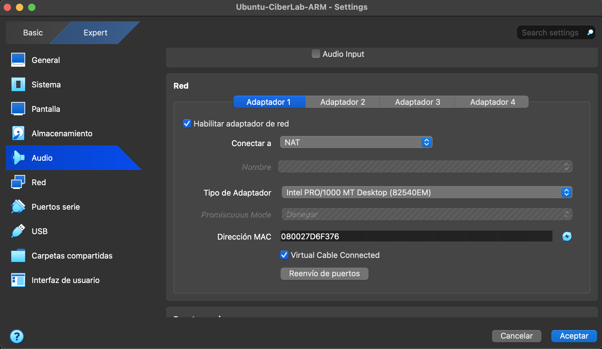
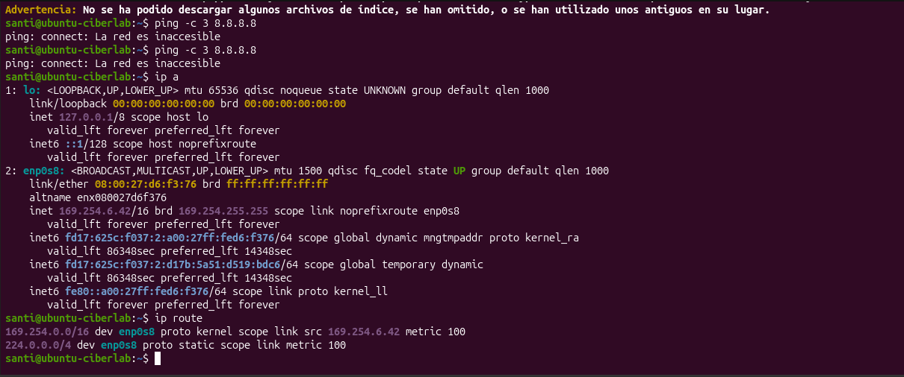
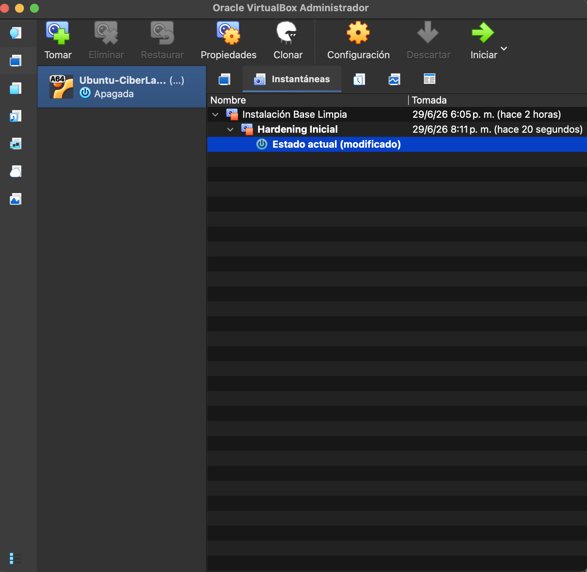

# Laboratorio de Virtualización y Aislamiento con VirtualBox

## Objetivo

Crear un entorno de pruebas aislado mediante VirtualBox para practicar conceptos de ciberseguridad sin poner en riesgo el equipo anfitrión (Host).

## Entorno utilizado

- **Host:** MacBook Pro con macOS y procesador Apple Silicon (M2).
- **Hipervisor:** Oracle VirtualBox 7.2.10.
- **Sistema invitado (Guest):** Ubuntu 25.04 (ARM64).
- **Nombre de la VM:** `Ubuntu-CiberLab-ARM` — 2 CPU, ~3 GB RAM, disco de 25 GB.

## 1. Red en modo NAT

La máquina virtual se configuró con el **Adaptador 1 en modo NAT**.

**Por qué elegí NAT:** con NAT la VM puede salir a Internet (necesario para actualizar el sistema) pero queda escondida detrás del Host; el resto de los dispositivos de mi red doméstica no la ven como un equipo más.

- Descarté el **Adaptador Puente (Bridge)** porque expondría la VM como un dispositivo visible dentro de mi red local, algo riesgoso al hacer prácticas de seguridad.
- Descarté la **Red Interna** porque, si bien es la opción más aislada, deja la VM sin Internet y eso impide actualizar el sistema.

Acá aparece el equilibrio entre **aislamiento y usabilidad**: la Red Interna es más segura pero inutiliza un paso necesario; NAT da el punto justo para esta práctica.

## 2. Usuario estándar (principio de menor privilegio)

Se creó el usuario `practicas` como cuenta **Estándar**, separada de la cuenta administradora (`santiago`). La idea es trabajar en el día a día sin permisos de administrador, de modo que un error propio o un programa malicioso no comprometa todo el sistema.

## 3. Actualización del sistema (intento y diagnóstico)

Se ejecutó `sudo apt update` y `sudo apt upgrade` desde la cuenta administradora. La actualización **no pudo completarse**: la VM no obtuvo conexión a Internet a través del NAT.

Diagnóstico realizado desde la terminal:

- `ping -c 3 8.8.8.8` → respuesta "La red es inaccesible".
- `ip a` → la interfaz recibió una dirección **APIPA (169.254.x.x)**, que es la que el sistema se autoasigna cuando el servidor DHCP del NAT no le entrega una IP válida.
- `ip route` → **no aparece una ruta por defecto** (default gateway), por eso no hay salida a Internet.

Esto corresponde a una **limitación conocida del NAT de VirtualBox sobre Apple Silicon (ARM)**, no a un error de configuración del laboratorio. Gracias al snapshot del punto 4, la actualización se puede reintentar más adelante sin rehacer todo el entorno.

## 4. Snapshot "Hardening Inicial"

Con la VM apagada se tomó una instantánea llamada **Hardening Inicial**, después de configurar la red en NAT y crear el usuario estándar. Funciona como punto de restauración para volver a un estado seguro antes de cualquier prueba.

## Buenas prácticas aplicadas

- Red NAT: la VM sale a Internet pero queda oculta detrás del Host, sin exponerse en la red local.
- Usuario estándar separado del administrador (menor privilegio).
- Portapapeles compartido y carpetas compartidas deshabilitados.
- Snapshot como punto de restauración antes de empezar a practicar.

## Pendiente

- Completar la actualización del sistema una vez resuelta la conexión NAT en el entorno ARM. Al existir el snapshot "Hardening Inicial", el reintento no implica rehacer el laboratorio.
