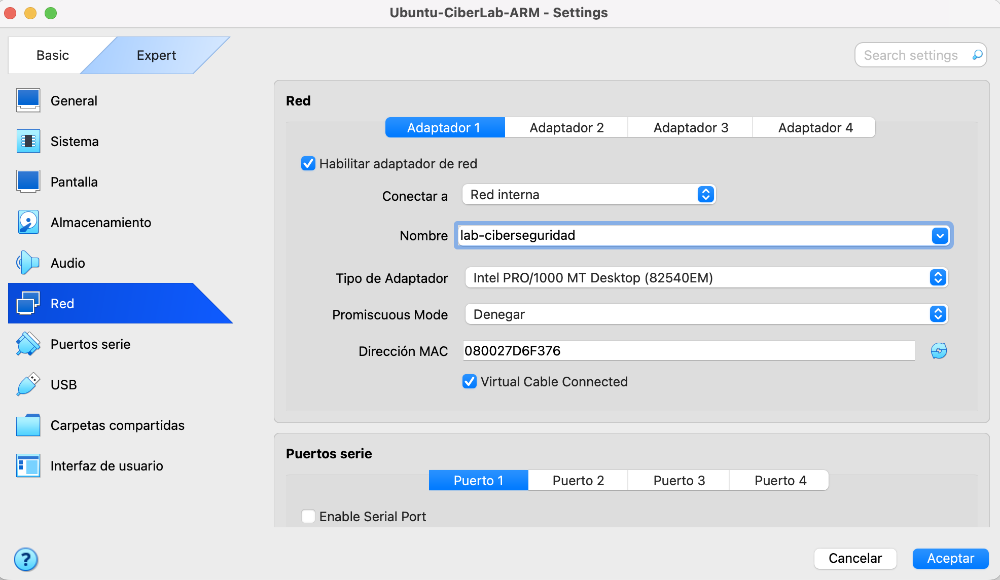
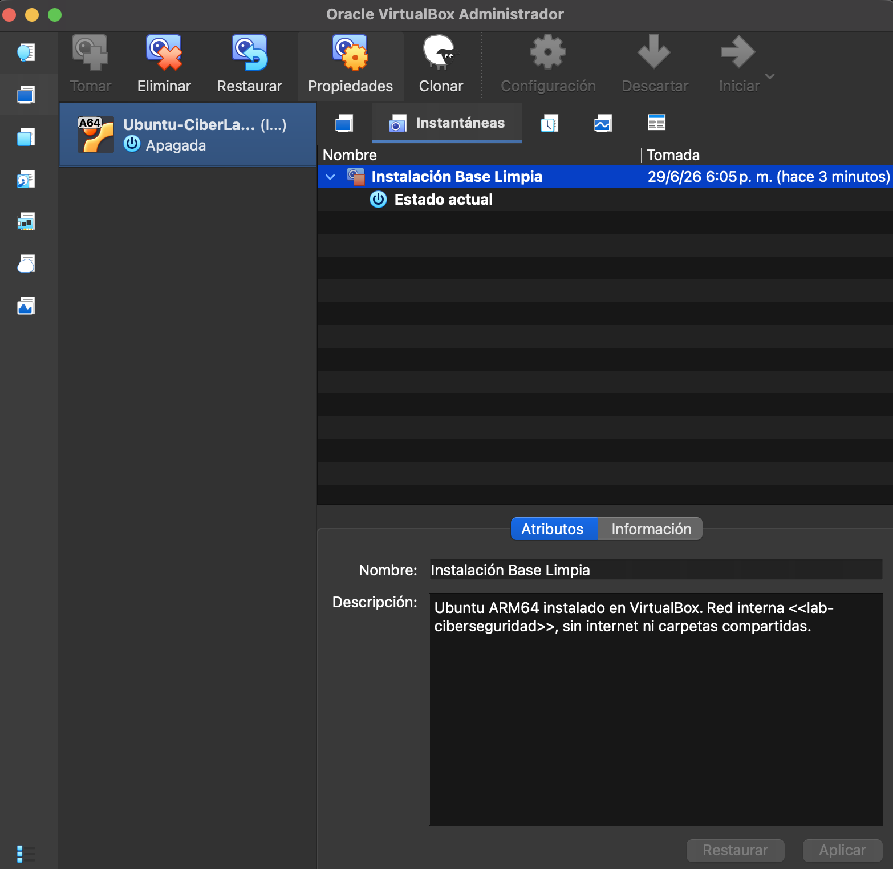

# Laboratorio de Virtualización y Aislamiento con VirtualBox

## Objetivo

Crear un entorno de pruebas aislado mediante VirtualBox para practicar conceptos de ciberseguridad sin poner en riesgo el equipo anfitrión.

## Entorno utilizado

* **Equipo anfitrión (Host):** MacBook Pro con macOS y procesador Apple Silicon M2.
* **Hipervisor:** Oracle VirtualBox 7.2.10.
* **Extension Pack:** Oracle VirtualBox Extension Pack 7.2.10.
* **Sistema invitado (Guest):** Ubuntu Desktop 26.04 ARM64.
* **Nombre de la máquina virtual:** `Ubuntu-CiberLab-ARM`.
* **Memoria RAM asignada:** 3139 MB.
* **Procesadores asignados:** 2.
* **Disco virtual:** 25 GB.
* **Firmware de arranque:** EFI habilitado.

## Configuración de red

La máquina virtual fue configurada con el modo **Red interna** y con el siguiente nombre de red:

```text
lab-ciberseguridad
```



## Justificación técnica

Elegí el modo **Red interna** porque esta práctica inicial no requiere acceso a Internet. Este tipo de red crea un entorno cerrado entre las máquinas virtuales que usen el mismo nombre de red, sin conexión directa con Internet, el equipo anfitrión ni la red doméstica.

Esta configuración permite reducir el riesgo de que una máquina virtual comprometida pueda comunicarse con otros dispositivos de mi red local, como teléfonos, televisores, otros equipos o el router.

No utilicé el modo **Adaptador Puente (Bridged)** porque conecta la máquina virtual a la misma red física que utiliza el equipo anfitrión. Eso haría que la máquina virtual fuera visible como otro dispositivo dentro de la red doméstica y aumentaría el riesgo durante prácticas de ciberseguridad.

Como medidas adicionales de aislamiento, se configuró lo siguiente:

* Portapapeles compartido deshabilitado.
* Arrastrar y soltar deshabilitado.
* Sin carpetas compartidas entre el Host y el Guest.
* Sin acceso a Internet desde la VM.

## Snapshot inicial

Luego de instalar Ubuntu y configurar el aislamiento de red, se creó una instantánea llamada:

```text
Instalación Base Limpia
```

Esta instantánea funciona como un punto de restauración. Antes de hacer pruebas, instalar herramientas o ejecutar configuraciones experimentales, puedo volver a este estado seguro sin tener que reinstalar todo el sistema operativo.



## Buenas prácticas aplicadas

* Uso de una imagen oficial de Ubuntu Desktop ARM64 compatible con Apple Silicon.
* Recursos moderados para no afectar el rendimiento del equipo anfitrión.
* Red interna aislada.
* Sin adaptador puente.
* Sin carpetas compartidas.
* Portapapeles compartido deshabilitado.
* Arrastrar y soltar deshabilitado.
* Snapshot creado antes de realizar prácticas de seguridad.
